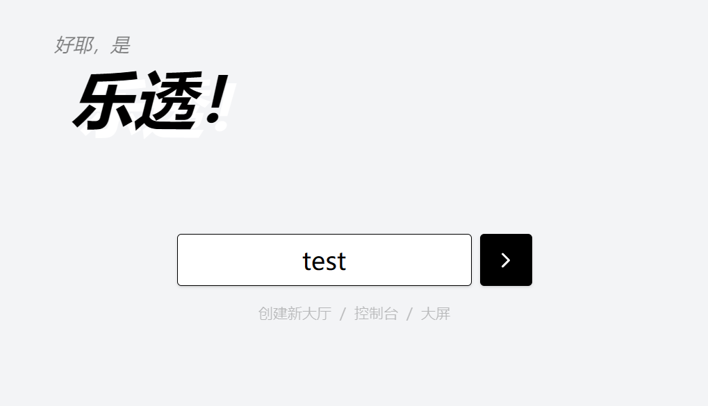

# Lottery

基于 WebSocket 的在线发号 & 摇号抽奖 Web App

## Preview

[lott.mofu.app](https://lott.mofu.app)（此部署限制单 Lobby 最多 2000 人在线）

<p align="center">
  
  
</p>

## Deploy

```sh
docker compose build
docker compose up
```

然后访问 `http://localhost:3080`

也可以创建 `compose.override.yml` 来重写 Docker Compose 配置

## Configure

参考 `.env.backend.example` 创建 `.env.backend`，或者在 `compose.override.yml` 中设置环境变量

## Development

```sh
pnpm i
pnpm dev:backend
pnpm dev:web
```
